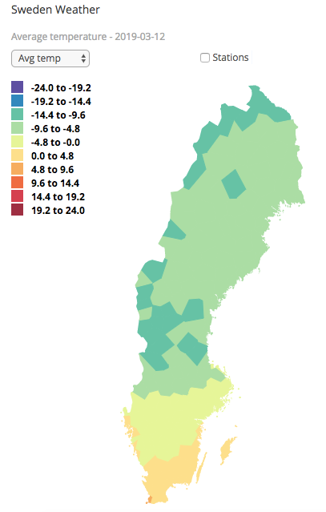

# Clover

Clover is a small project to
1. Automatically collect a selection of open weather data from SMHI
2. Display this data using an SVG map of Sweden

The purpose is a [D3](https://d3js.org/) excercise using some real data. The specifics are described in 
[blog postings](https://www.viltstigen.se/wolfblog/2019/03/30/lets-make-a-map/).
Use [this link](https://www.viltstigen.se/clover/index.html) to view the implementation

A variation of techniques is used, deploying a client-server architecture.
* D3 is used to render the weather data in a Web browser client, javascript code in `index.html`
* Python scripts is used to collect data and dispatch this to the client in JSON format when requested
    * `collector.py`, a threaded daemon script collecting data, configured to run from crontab once per day
    * `emitter.py`, a flask based python script, reading the data the collector-script stored and returning this 
    in JSON format.

A few tools is used to build the infrastructure, such as [Flask](http://flask.pocoo.org/), 
[Gunicorn](https://gunicorn.org/), [Boostrap](https://getbootstrap.com/), [jQuery](https://jquery.com/), 
[requests](http://docs.python-requests.org/en/master/). 
[Nginx](http://nginx.org/en/) is used as HTTP-proxy and server. See below.

## Infrastructure

Using a raspberry environment, the following nodes are used
* `rpi1`: The primary web-server for the domain [`viltstigen.se`](www.viltstigen.se), running nginx as web proxy/server
* `rpi2`: The server running the `collector` daemon and the `emitter` flask/gunicorn server listening on port 8096

The raspberries are protected by [`ufw` firewall](http://manpages.ubuntu.com/manpages/bionic/en/man8/ufw.8.html) 
that needs to be configured.

The client-to-server flow is
* A webclient on internet wants to reach the clover `index.html` page through `rpi1` which passes the request using 
nginx to `rpi2`.
* `rpi2` returns the `index.html` page to the client that execute the javascript included. This triggers an ajax-request
to download the weather data in JSON format. The ajax request is forwarded by `rpi1/nginx` to `rpi2` on port 8096 where
the `emitter` script is listening. The `emitter` script returns the data reading a file created by the `collector` script.

## Installation

Using python3, requests, flask and gunicorn in a virtual environment, on `rpi2`

    $ mkvirtualenv --python=/usr/bin/python3 clover
    $ workon clover
    (clover) $ pip3 install requests
    (clover) $ pip3 install flask
    (clover) $ pip3 install gunicorn
    
The `emitter.py` script reads from `/var/local/clover_weather.js`, softlink this

    $ sudo ln -s /home/pi/app/clover/data/weather.js clover_weather.js
    
## nginx configuration

On `rpi1`, in nginx configuration file (my case: `/etc/nginx/snippets/locations.conf`) add this,

    location /clover {
        try_files $uri $uri/ $uri/index.html $uri.html @clover;
    }
    
    location @clover {
        # proxy_pass http://rpi2.local; Note, a static IP address makes nginx more robust in case rpi1 is not running
        proxy_pass http://192.168.1.51:8096;
        proxy_redirect     off;
        proxy_set_header   Host $host;
        proxy_set_header   X-Real-IP $remote_addr;
        proxy_set_header   X-Forwarded-For $proxy_add_x_forwarded_for;
        proxy_set_header   X-Forwarded-Host $server_name;
        proxy_read_timeout 300;
    }
    
    location /clover_data {
    try_files $uri $uri/ $uri/index.html $uri.html @clover_data;
    }

    location @clover_data {
        # proxy_pass http://rpi2.local; Note, a static IP address makes nginx more robust in case rpi1 is not running
        proxy_pass http://192.168.1.51:8096;
        proxy_redirect     off;
        proxy_set_header   Host $host;
        proxy_set_header   X-Real-IP $remote_addr;
        proxy_set_header   X-Forwarded-For $proxy_add_x_forwarded_for;
        proxy_set_header   X-Forwarded-Host $server_name;
        proxy_read_timeout 300;
    }

Do

    $ sudo nginx -t
    nginx: the configuration file /etc/nginx/nginx.conf syntax is ok
    nginx: configuration file /etc/nginx/nginx.conf test is successful
    $ sudo service nginx restart

On `rpi2`, open up the firewall by

    $ sudo ufw allow from 192.168.1.0/24 to any port 8096
    $ sudo ufw allow from 192.168.1.0/24 to any port 80

(In case of errors, remove byte compiled code for ufw by: `$ sudo rm /usr/lib/python3/dist-packages/ufw/__pycache__/*.pyc`)

Link the clover directory in the nginx-root (`/var/www/html`) at `rpi2` by (assuming clover is installed at
`/home/pi/app)

    $ sudo ln -s /home/pi/app/clover/ clover

## gunicorn and Flask
    
Update [supervisor](http://supervisord.org/) with the new gunicorn server app

    $ cd /etc/supervisor/conf.d
    $ sudo ln -s /home/pi/app/clover/py/clover_gunicorn.conf clover_gunicorn.conf
    $ sudo supervisorctl reread
    $ sudo supervisorctl update
    
Check status with

    $ sudo supervisorctl status

gunicorn is now running a WSGIserver, listening on port 8096, connected to this is the Flask application that reads
the weather json file, dump the content to a string which is returned from Flask to gunicorn which then respond to the
HTML GET-request submitted upstream by nginx running on `rpi1`.

If needed, debug Flask using

    $ export FLASK_APP=emitter.py
    $ export FLASK_DEBUG=1
    $ flask run --host=0.0.0.0 --port=8096
    
Then try `http://rpi2.local:8096/clover` in a browser
